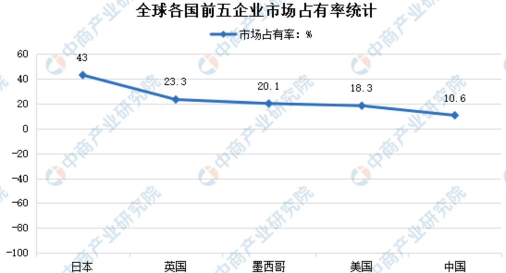

小作坊为什么能够存在
麦小六
星星之火可以燎原

# 当下面包市场分析
目的是为了了解整个行业形式，对未来做出合理决策；

达利、盼盼、好丽友 长保
桃李、宾堡、义利  短保

## 七大地理区
东北地区：辽宁省、吉林省、黑龙江省；
华北地区：北京市、天津市、河北省、山西省、内蒙古自治区；
华东地区：上海市、江苏省、浙江省、安徽省、福建省、江西省、山东省、台湾省；
华南地区：广东省、广西壮族自治区、海南省、香港特别行政区、澳门特别行政区；
华中地区：河南省、湖北省、湖南省；
西南地区：重庆市、四川省、贵州省、云南省、西藏自治区；
西北地区：陕西省、甘肃省、青海省、宁夏回族自治区、新疆维吾尔自治区。

[区域地图](http://m.news.xixik.com/content/bcadb576723264b5/)

## 行业大概
### 规模
整体规模和数据、行业年度经济收入

总体看面包市场规模近400亿，景气度向上、集中度不高

与全球市场相比，中国烘焙行业整体看集中度不高。相较于日本前五大公司集中度43%，中国烘焙行业前五大公司仅占市场总量的10.6%，市场尚有连锁化和整合的空间

参考： 
1. https://www.askci.com/news/chanye/20220701/1711421910498.shtml
2. https://www.chinabaogao.com/detail/608800.html

### 生命周期
发展是否有瓶颈、行业天花板、发展历史、发展趋势

行业空间大但集中度低，公司扩张模式成熟、壁垒高，有望稳步扩张成长为行业绝对龙头。达利进入短保市场合作大于竞争，看好公司长期成长及盈利能力提升空间。

https://www.hanghangcha.com/pdf.html
https://pdf.dfcfw.com/pdf/H3_AP201611220120250882_1.pdf?1479812316000.pdf

### 上下游供应
目前上市的桃李、山崎都是以 中央工厂+批发方式出售面包。
桃李主要布局全国工厂，物流分为一级物流和二级物流，一级物流直接从工厂送往KA客户；二级物流从工厂送往分销站，然后在配送周边中小超市、便利店。

而物流公司主要采取第三方物流模式，公司可控，但不归属于自己

## 桃李调查

山崎面包是桃李面包的学习对象。
时代背景：日本二战后，美国向日本大量出口小麦和脱脂奶粉。面包开始成为日本人的主要食物，影响后续饮食习惯。

山崎面包：以合理的价格提供优质的产品，顾客至上
委托加工起家，品类单一，面包为主 -----> 巩固区域大本营 -----> 布局全国工厂 ----> 海外扩张 -----> 全球化布局

桃李与山崎的共同点在于 物流，而物流的核心在于精细化管理

物流分为一级物流和二级物流，一级物流直接从工厂送往KA客户；二级物流从工厂送往分销站，然后在配送周边中小超市、便利店。
而物流公司主要采取第三方物流模式，公司可控，但不归属于自己。

对于短保而言，物流显得更为重要。

https://pdf.dfcfw.com/pdf/H3_AP202002251375442450_1.pdf?1601214928000.pdf

行业调查
- 龙头公司的财报： http://www.cninfo.com.cn/new/fulltextSearch?notautosubmit=&keyWord=%E6%A1%83%E6%9D%8E%E9%9D%A2%E5%8C%85

发展空间、所处阶段、竞争格局

行业调查
- 龙头公司的财报： http://www.cninfo.com.cn/new/fulltextSearch?notautosubmit=&keyWord=%E6%A1%83%E6%9D%8E%E9%9D%A2%E5%8C%85

桃李介绍：
95年成立
1. 行业归属：制造业-食品制造业-焙烤视频制造业-糕点、面包制造（1411）
2. 周期性特点：第一季度销售量低，第四季度高的特点
3. 产品：主营面包，次类为节日食品（月饼、粽子等）

经营模式：
1. 采购模式-自主采购模式：与多家原材料供货商进行谈判，一般每月会进行一次集中采购
2. 生产模式-以销定产：消费者对新鲜度要求高，产品保质期短；因此采用以销定产。比如中秋月饼，生产周期45-60天，集中在中秋节前后1-2月。下一次的生产量会根据去年销售情况进行变化。
3. 销售模式-直营和经销：面包是与人民生活密切相关的快速消费品。普通个人消费者会通过大型连锁商超（KA 客户）、便利店、县乡商店及小卖部等购买。一是针对大型连锁商超（KA 客户）和中心城市的中小超市、便利店终端，公司直接与其签署协议销售产品的模式；二是针对外埠市场的便利店、县乡商店、小卖部，公司通过经销商分销的经销模式。

核心竞争力：
1. 生产力的高性价比：生产设备，技术都是顶级
2. 品牌影响力：经常买面包的基本都知道
3. 销售渠道稳定：ka-沃尔玛、华润、永辉等连锁超市长期合作
4. 中央工厂+批发：利用规模经济优势，降低成本，可以用更多成本来保障食品质量和安全；可以接受新品如果失败，聚焦少而精（相对于这样规模的公司 品类其实不算多）
5. 对市场定位更精准，根据自身的强大可以迅速根据客户口味调整

核心产品：
1. 醇熟很稳定；岩烧、乳酪高速增长
2. 假日食品：月饼、粽子 持续增长

桃李当前对手
沈阳本地市场，桃李面包的大小商超、便利店等渠道基本都已经铺货全面，
主要竞争对手为好利来等实体面包房及 KA 商超自营面包店，压力不是很大。
 华北地区的天津、石家庄等区域，主要竞争对手为同渠道销售的国外品牌及
商场自营面包房。石家庄地区的稻香村等面包门店房，其产品丰富，客户体
验活动多；KA 商超自营面包房促销活动比较多，几乎每天到傍晚都会有买
一送一的活动，但其产品品质不及桃李。华中、西南地区的主要竞争对手为
当地知名度较高的品牌。
 武汉地区面临主要竞争对手是本地品牌面包房如皇冠蛋糕、仟吉等，竞争压
力比较大。重庆地区桃李面包虽然已经运作了几年的时间，但目前还没有进
入快速增长期，主要竞争对手为本地品牌，其产品差异性比较小，渠道差异
比较大，沁园、华生园的销售渠道主要为街边店，商超消费比较少。
 华南地区的东莞，桃李进入的时间最短，市场处于起步初创阶段，竞争对手
为本地品牌面包连锁店及嘉顿等

----------------------------
行业经营信息

经营模式：
中央工厂+批发模式：是企业在各个城市设立中央工厂，以工厂为圆心，通过集中物流配送，将产品批发给本地及周边城区的商场、超市或经销商，生产自动化程度较高，规模效应显著。
连锁门店模式：是将面包店开设在城镇人口密集的商业区和居民区，通过可视化操作和专业化的现场加工，最大限度的满足顾客在产品质量、口感和新鲜程度等方面的要求。（好利来）
中央工厂+线上销售模式：没有实体门店，更为轻资产，以低价、促销策略吸引新用户。

采用“中央工厂+批发”模式进行生产经营的有“宾堡”等国外品牌和“桃李”等国内品牌，其主要通过商场超市等销售终端将产
品投向市场，与同样以商场超市作为主要销售渠道的当地品牌竞争市场份额；采用连锁店模式的
有“巴黎贝甜”等国外品牌和“克莉丝汀”、“好利来”等国内品牌于中高端消费群体，

面包种类-保质期分类：
按照保质期长短，面包行业可以细分为长保、中保和短保。长保面包发展较早，但是由于其
口感，新鲜度，健康性等方面相比中短保面包有明显的劣势，长保面包逐渐有被中短保面包所取
代的趋势。中保面包近年受益于线上电商的繁荣，规模不断扩大，逐渐在休闲零食中占得一席之
地。短保面包的主要消费场景是早餐，在生活节奏加快、西式饮食习惯逐渐渗透的背景下，短保
面包便捷健康的特点更符合消费者需求。

发展趋势：
随着经济发展，整个市场的大型烘焙企业规模呈扩大趋势，工业化烘焙的经营模式逐步占领市场，形成跨地区的企业和名牌产品。
1. 大型生产商较少，此类投入大，专业技术高，大部分都是地方区域内的中小企业为主，生产工艺以小作坊为主，技术参差不齐。
2. 随着食品安全的重视，加工趋于专业化和标准化
3. 品牌依赖性越来越高：对于行业的发展是好事，品牌的竞争带来的规范良性发展（垄断后才恶性）。对于小企业的从0到1是困难的

当下格局：
1. 小型加工作坊不断被淘汰，知名度高的品牌，规模效应的企业比小作坊有名，同类产品可以做到更低廉。
2. 行业集中度低：垄断程度低，容易发展
3. 产品竞争激烈同质化现象严重：一个产品的爆款，多企业互相模仿

未来
1. 产品差异化更加明显：适应不同类人群：老人、学生、办公族、减肥、营养等
2. 营销网络和渠道：决定了扩张速度和低成本
3. 地方性企业众多，竞争激烈：缺乏特色的企业会退出市场
4. 线上营销：加入客户端、数字化建设
5. 桃李学习的是山崎，山崎在达到市场瓶颈后，开始了直营店的方式提高品牌影响力，桃李也许也会如此

客户从吃的饱到吃得好

什么时候要吃饱、什么时候要吃好

让自己保持客观，不要被第一份或者前几份资料所影响，就对行业妄下判断；一周时间我们只能对行业有认知雏形，虽然行业大规律想通，但隔行如隔山，不要因为初始印象影响后续判断；有价值的点都记录下来形成思维导图，不断审查对比
关键字：
行业集中度；规模效应；unit economics：单位经济效益；分流效应；

参考：
1. https://www.chinabaogao.com/detail/608800.html
2. http://static.cninfo.com.cn/finalpage/2022-03-17/1212591707.PDF
3. https://pdf.dfcfw.com/pdf/H3_AP201611220120250882_1.pdf?1479812316000.pdf
4. https://pdf.dfcfw.com/pdf/H3_AP202002251375442450_1.pdf?1601214928000.pdf
5. http://www.199it.com/archives/1042590.html
6. http://static.cninfo.com.cn/finalpage/2022-08-11/1214265442.PDF
工具：巨潮资讯：获取上市公司财务情况、199it

