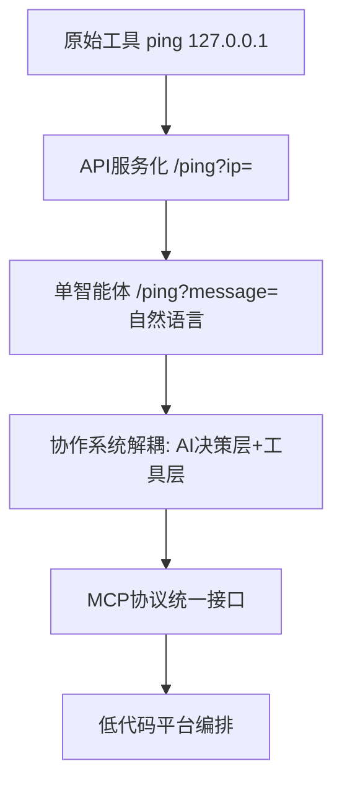

## 原始程序
最初的ping命令是一个典型的命令行工具，它遵循严格的参数规范：
```bash
ping 127.0.0.1
```

## API服务化阶段
用代码简单增加个http服务，调用后台的系统命令
```http
GET /api/ping?ip=127.0.0.1
```
这个阶段实现了服务化，提高了接入性和可用性

## 单体智能体（Single Agent）
代码中加入ai模型或者ai的api，将请求的信息推理出符合ping命令的参数
```http
POST /api/ping
{
    "query": "检查谷歌服务器是否可访问"
}

利用提示词和ai，可以返回 ping www.google.com
```

### 优化单体智能体（Single Agent）
写过代码的都知道，现在这个程序有原始业务还有ai，我们应该解耦，便于扩展支持其他ai模型。那么这样的话程序回归最原始的api服务。
增加一个新的服务或模块，利用提示词，比如让ai只返回ip: {"ip":"127.0.0.1"}，然后在用代码将返回内容传给api（或者改为函数调用）

> 大部分ai模型提供了符合open ai标准的接口，如果没有就需要在智能体层增加适配

## 多智能体协作（Multi-Agent Collaboration）
随着任务复杂度提升，单个智能体难以胜任所有工作。例如一个网络诊断任务可能需要：
- Ping检测智能体：检查网络连通性
- 安全扫描智能体：进行漏洞检测
- 性能分析智能体：评估网络性能

为了实现多智能体协作，需要：
1. 任务编排层：负责任务分解和流程管理
2. 消息传递协议：如MCP（Message Communication Protocol）规范化智能体间的通信
3. 上下文管理：维护多个智能体之间的信息共享和状态同步

这时候3.1步骤的作用体现出来了，可以在此层进行一些工程化的开发，将用户输入进行任务分解管理，agent管理。
类似
## LLM应用平台
- 可视化的智能体编排界面
- 预置的常用智能体组件
- 简单的业务流程定制能力
- 完整的运维和监控功能
