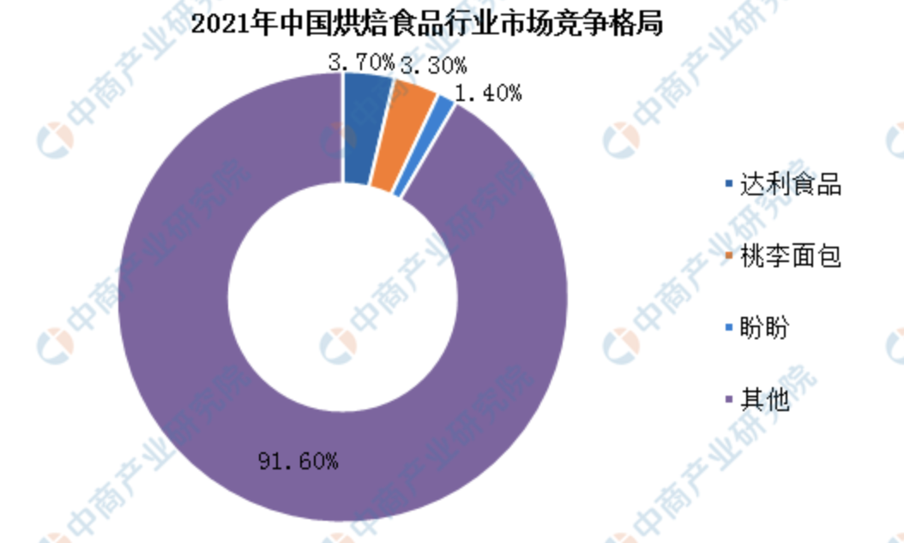

任何决策之前都需要调查，没有调查就没有发言权。做生意就要研究调查一个市场的情况，分析接下来要做什么，怎么做。
很明显，我们当下目标无论怎样都不能脱离天津，因此首先要对天津市场做分析才能做出合理规划。然而一个行业会受到各种变量的影响，大到国家的政策、龙头企业的影响力（龙头企业可以对行业标准的制定有影响力），小到区域的影响力、同行的竞争；还有气候、疫情等自然因素。因此在讨论天津形式之前不得不讨论当下龙头企业的市场行情，在讨论龙头市场行情之前不得不讨论整个烘焙市场情况。

无论是长久未来的发展还是从当前市场竞争或可见未来要遇到的困难，都急迫要合理规划好一个战略目标，指导发展路线。下面我将从宏观到微观的进行分析行业市场情况，再做出个人决策看法。

# 中国烘焙行业的当下格局
行业规模决定了当下的市场上限，100份的蛋糕如果都已经被瓜分，这个行业也就没有介入的机会。

目前来看面包市场规模近400亿，景气度向上、集中度不高。这两个词什么意思？ 景气度向上说明了这个行业在可见的未来是繁荣发展的，相反的例子就是油车在未来发展是不景气的；集中度不高表示这个行业的垄断能力弱，虽然桃李目前是国内龙头，但只是在整体市场方面，细化到区域甚至地方都有中小企业竞争。

与全球市场相比，中国烘焙行业整体看集中度不高。相较于日本前五大公司集中度43%，中国烘焙行业前五大公司仅占市场总量的10.6%，市场尚有连锁化和整合的空间

另外每个行业都有生命周期，比如缝纫机产业就已经消亡，但食品行业一般是不会因科技、社会发展等因素而被取代。

因此我国的烘焙行业未来是乐观的（市场大），眼下是惨烈的（集中度低导致竞争大）

参考： 
1. https://www.askci.com/news/chanye/20220701/1711421910498.shtml
2. https://www.chinabaogao.com/detail/608800.html

# 桃李龙头企业的市场形式
## 上下游供应
目前上市的桃李、山崎都是以 中央工厂+批发方式出售面包。
桃李主要布局全国工厂，物流分为一级物流和二级物流，一级物流直接从工厂送往KA客户；二级物流从工厂送往分销站，然后在配送周边中小超市、便利店。

而物流公司主要采取第三方物流模式，公司可控，但不归属于自己

# 天津市场

# 关键字介绍
## 集中度
挂面的行业集中度极低，2020年我国挂面TOP2企业克明和金沙河的份额仅为4.4%和3.1%。而方便面康师傅和统一的零售份额分别为43.2%和14.7%。为什么同样是面食，行业集中度会差距这么大。

除了烟草石油被国家掌管，其他行业一家独大，对于社会层面来讲是不好的，良性竞争才能发展。尽管如此，不同行业有它的特殊性质，集中度就会天然的不同。

下面从几个方面说一下可能影响集中度的地方。

### 行业规模的成长
不同行业的成长是有大差异的，以微信和淘宝为例，微信增长1个用户，潜在会增长1个以上，因为微信的用户之间是有关联的，朋友都用，你就不得不用。而淘宝用户之间是无关联的，甚至用户与商家直接都无关联，只与具体产品想关联。因此京东，拼多多可以瓜分市场。

### 技术门槛越高，马太效应越显著
马太效应指的是：强者只会越来越强，弱者只会越来越弱。
如芯片行业，门槛极高，而且随着时间推移，先来的水平会越来越高，最终造成一家独大 （荷兰的ASML公司垄断了光刻机，全球高端光刻机只有这一家）。

### 同质化
上面说的是门槛高，与其相反的就是门槛低，因为门槛低所以互相模仿更为容易，面包行业就在此列

### 品牌效益
指的是品牌带动产品而产生的效益和影响，举个最简单的例子，你买了个包或者一双鞋别人会问你是什么牌子的。而你吃的面包或者方便面，没人会问你，甚至你自己也不在乎。因此烘焙行业的品牌效益在初期阶段是次要的（想要发展是需要一个特定品牌的，想要保持一般的收入无所谓品牌）

### 产品特点
1. 保质期： 牛奶、面包、糕点行业因为保质期问题，无法全国性质的铺货销售，导致了企业数量多，规模都不大，市场集中度就较低。即便是桃李也难以企及全国各地
2. 运输：桶装水、冰淇淋企业很难实现跨区域经营，基本上以本区域市场为主，导致了企业规模难以做大，市场集中度也不高
3. 制作工艺：手工艺品、土特产之类，受制于特定区域的消费偏好，大多偏居一隅，很难走向全国市场，市场销量有限，市场集中度自然不高

### 发展阶段
任何行业的初期都会竞争激烈，集中度低是不言而喻的。

### 进退壁垒
进可攻、退可守的行业，比如中介、餐饮，容易获利也容易暴毙，但成本较低因此集中度低，竞争激烈

# 我们当下的策略与目标
